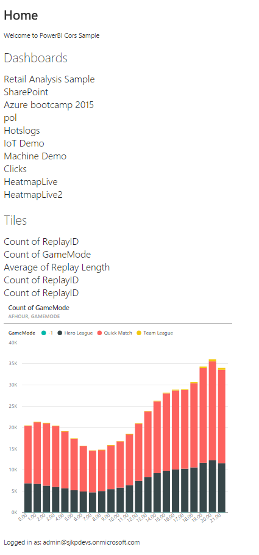
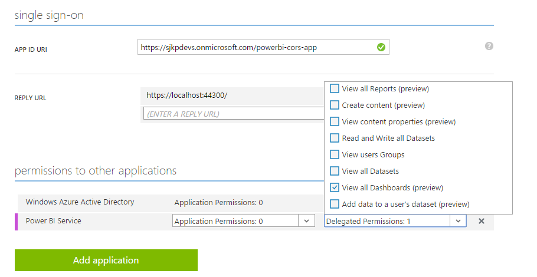

# PowerBI-cors-app-ts
This is a sample application that shows how to use AngularJS, TypeScript and the ADAL.js to display tiles from PowerBI in a single page web application. 

The following screenshot show what the sample looks like. It lists all dashboards, when a dashboard is clicked it lists all tiles from that dashboard. When a tile is click the tile is shown in the iframe. 

When the iframe is clicked the powerbi report will open in a new window.



## How To Run This Sample

Getting started is simple!  To run this sample you will need:
- Visual Studio Code (or Visual Studio 2015)
- Node.js installed 
- An Internet connection
- An Azure subscription (a free trial is sufficient)
- A PowerBI subscription that is linked to your Azure Active Directory. 

Every Azure subscription has an associated Azure Active Directory tenant.  If you don't already have an Azure subscription, you can get a free subscription by signing up at [http://www.windowsazure.com](http://www.windowsazure.com).  All of the Azure AD features used by this sample are available free of charge.

### Step 1:  Clone or download this repository

From your shell or command line:
`git clone https://github.com/sjkp/powerbi-cors-app-ts.git`

### Step 2:  Register the sample with your Azure Active Directory tenant

1. Sign in to the [Azure management portal](https://manage.windowsazure.com).
2. Click on Active Directory in the left hand nav.
3. Click the directory tenant where you wish to register the sample application.
4. Click the Applications tab.
5. In the drawer, click Add.
6. Click "Add an application my organization is developing".
7. Enter a friendly name for the application, for example "powerbi-cors-app", select "Web Application and/or Web API", and click next.
8. For the sign-on URL, enter the base URL for the sample, which is by default `https://localhost:44300/`.
9. For the App ID URI, enter `https://<your_tenant_name>/powerbi-cors-app`, replacing `<your_tenant_name>` with the name of your Azure AD tenant.


All done!  Before moving on to the next step, you need to find the Client ID of your application, and allow the application to use PowerBI. 

1. While still in the Azure portal, click the Configure tab of your application.
2. Find the Client ID value and copy it to the clipboard.
3. Scroll to the bottom of the Configure tab, and click add application 
4. Select the PowerBI Service 
5. Under delegated permissions, grant the View All Dashboards (preview) permisison



### Step 3:  Enable the OAuth2 implicit grant for your application

By default, applications provisioned in Azure AD are not enabled to use the OAuth2 implicit grant. In order to run this sample, you need to explicitly opt in.

1. From the former steps, your browser should still be on the Azure management portal - and specifically, displaying the Configure tab of your application's entry.
2. Using the Manage Manifest button in the drawer, download the manifest file for the application and save it to disk.
3. Open the manifest file with a text editor. Search for the `oauth2AllowImplicitFlow` property. You will find that it is set to `false`; change it to `true` and save the file.
4. Using the Manage Manifest button, upload the updated manifest file. Save the configuration of the app.

### Step 4:  Configure the sample to use your Azure Active Directory tenant

1. Open the folder in Visual Studio Code.
2. Open the `wwwroot\app\core\core.adal.ts` file.
3. Find the app id `core.constant('appId', '<your-client-id>');` and replace the `<your-client-id>` with the Client ID from the Azure portal.
4. Find the tenant `tenant: '<your-tenant>.onmicrosoft.com',` and replace the `<your-tenant>` with your tenant name.

### Step 5:  Run the sample
To run the application do the following from your commandline:
```
npm install 
bower install
gulp build 
gulp serve
```

##Additional information

The application structure was created using the yeoman generator [ng-ts](https://github.com/olohmann/generator-ng-ts#readme)
```
yo ng-ts
```